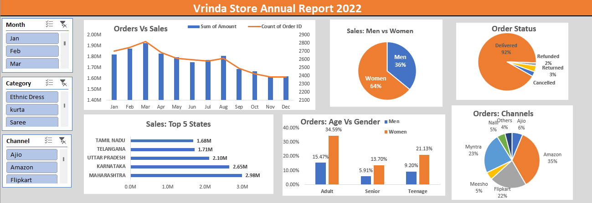

# **Sales Analysis for Vrinda Store**

This project focuses on analyzing sales data for **Vrinda Store** to derive insights and make data-driven business decisions. The analysis highlights customer trends, top-performing regions, and actionable strategies to boost sales.

---

## **Key Insights**
1. **Customer Demographics**:
   - Women contribute **~65% of total orders**, making them the largest audience.
   - Adults aged **30-49** account for **~50% of sales**.

2. **Top-Performing Regions**:
   - Maharashtra, Karnataka, and Uttar Pradesh collectively contribute **~35% of total sales**.

3. **Sales Channels**:
   - Online platforms like **Amazon**, **Flipkart**, and **Myntra** generate **~80% of total sales**.

---

## **Dynamic Analysis with Sliders**
The analysis includes an **interactive slider feature** for:
- **Month**: Analyze sales trends across specific months (e.g., peak months like December).
- **Channel**: View performance of sales channels (e.g., Amazon, Flipkart, Myntra).
- **Category**: Drill down into product categories like kurtas, tops, or sets.

These interactive tools provide flexibility for stakeholders to focus on specific parameters and generate custom insights.

---

## **Tools and Skills Used**
1. **Data Cleaning**: Prepared datasets for accurate analysis.
2. **Data Processing**: Extracted key metrics like gender, region, and product categories.
3. **Visualization**: Created pivot charts and interactive sliders in **Excel** for dynamic exploration.
4. **Insights Generation**: Identified business patterns and actionable strategies for sales improvement.

---

## **Sample Visualizations**
Here’s a preview of the types of insights derived:
- Gender-based sales trends.
- Regional performance (e.g., Maharashtra, Karnataka, and UP as top regions).
- Monthly and category-wise breakdowns of sales.

---

## **Conclusion**
This project demonstrates how interactive tools and data-driven strategies can uncover valuable insights to optimize sales and improve customer targeting.

---

**Note**: The dataset and project files are available upon request or can be viewed in the repository. 😊

